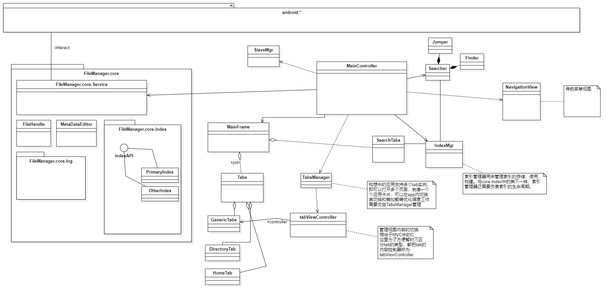

# 应用架构逻辑

#tag: 1.0

[toc]

## 关于Android SDK的官方文档：

-> https://developer.android.google.cn/docs

> 下面仅仅枚举了少部分类的介绍，先看个大概，如果有后续理解和扩展，欢迎push上来（不是master分支）

## 1. 主活动MainActivity 

* **简述**

  管理应用的生命周期，调用和交互的起点，目前作为MainFrame(主框架)，在实际代码中沿用了MainActivity 的名称。

* 具体职责

  * 初始化 MainController类

    -> [MainController](#main-controller)

  * 系统事件接受的父节点

    许多系统事件可以通过该类接受，过滤，再决定是否委派给MainController， 具体的处理逻辑不需要在MainFrame中处理，只需要根据程序的需要，转发给MainController，MainController会通过应用的状态，选择想要的监听器处理该事件，如此为止，是为了提高MainFrame的显示功能，分离ui显示与业务事件处理的职责。

  * 上下文起点

    android 框架中有许多函数与类的初始化都离不开给定的上下文（Context) ,

    有关上下文的其他用途具体可参见官方文档

  * *BroadcastReceiver & content-Provider* 

    ​	与其他应用交互的广播接受器，和内容提供者。MainFrame目前测试open功能可能需要担任。 

    ​	目前而言， 文件浏览器的相对比较独立，不太需要和其他程序进行内容交互，但在对于即将实现open功能和 share功能时，我们就不得不考虑，向android-manifest 中注册 一些其他活动类来作为intent 传递者，具体实现目前还有待确定

## 2. 主控类(MainController)

 * 简述

   主活动的职责分担类，设有多个供主活动使用的回调函数。如果需要控制的东西比较多，则需要再进行职责划分

* 监控程序状态

  例如： core.Service 类初始化失败， 主活动可以通过其指针获得相对应的状态，从而更好地汇报给上层类对象以及处理各类后台操作的异常，包括但不限于文件基本操作的失败和异常。

* 事件分发处理 EventDispatcher

  **事件监听机制借助了java的接口机制**

  ​	主控器可根据程序的状态和业务逻辑，分发事件给相对应的Listener。目前版本中，在MainController中注册的监听器主要是用于处理系统事件中的动作事件，按键事件。

  ​	另外，注册监听器的方式是反向的，中心化处理的注册，这就使得MainController 更像是一个代理。 因为其基本模式就是转发事件的传递。

  

## 3. 后台服务类（core.*)

 * 简述

   包含FileHandle, Service ， 和一些接口

* Service 

  提供基础的文件访问操作, 复制，移动，检查可读写性。 

* FileHandle 

  是对File类的进一步功能封装，并增设了一些常用必要静态函数

## 4. 概念类图

这是个概念类图，具体的类及其包含的方法和这个差得不是很多。篇幅有限，看概念类类图主要是看关系，不是看类能做什么的。

至于交互图里的顺序图或者协作图，我打算在比较难以沟通的场景绘制。

## 其他

